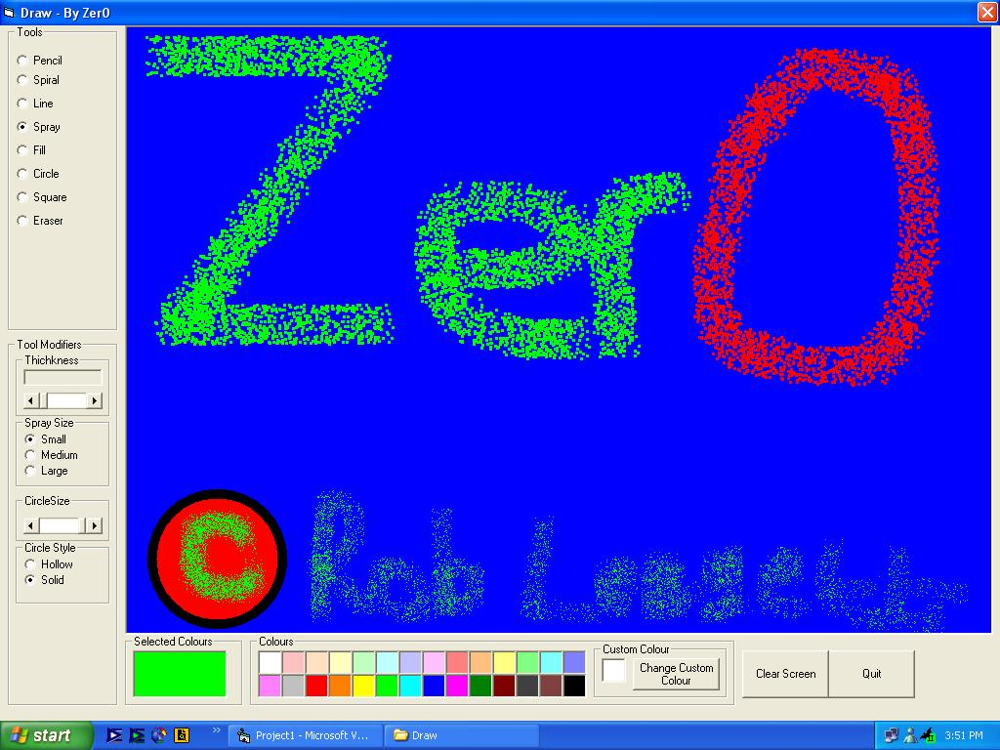



## Drawing Program WITHOUT using API

### Description

This is a good example of how VB can be used to create Graphics. It doesn't look as nice s it did this is because i lost the source forms etc and had to reconstruct it from a word document with the code. But anyway its got some bugs in it. If you fix these please comment and i'll give you credit in the next version. Remember to run it at 1024x768 resolution or it won't work properly. Please comment and or vote
 
### More Info
 

             |
---                |---
**Submitted On**   |2002-03-13 15:52:18
**By**             |[Zer0](https://github.com/Planet-Source-Code/PSCIndex/blob/master/ByAuthor/zer0.md)
**Level**          |Beginner
**User Rating**    |4.0 (8 globes from 2 users)
**Compatibility**  |VB 6\.0
**Category**       |[Graphics](https://github.com/Planet-Source-Code/PSCIndex/blob/master/ByCategory/graphics__1-46.md)
**World**          |[Visual Basic](https://github.com/Planet-Source-Code/PSCIndex/blob/master/ByWorld/visual-basic.md)
**Archive File**   |[Simple\_Dra618413132002\.zip](https://github.com/Planet-Source-Code/zer0-drawing-program-without-using-api__1-32648/archive/master.zip)

